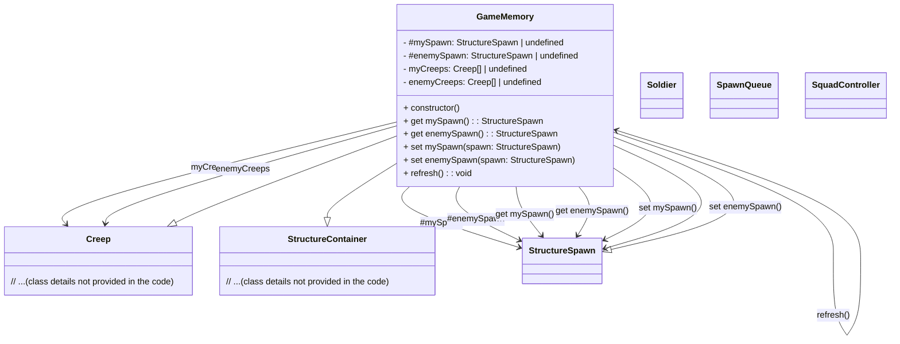

```mermaid
classDiagram
  class Creep {
    // ... (class details not provided in the code)
  }
  class GameMemory{
    - #mySpawn: StructureSpawn | undefined
    - #enemySpawn: StructureSpawn | undefined
    - myCreeps: Creep[] | undefined
    - enemyCreeps: Creep[] | undefined
    + constructor()
    + get mySpawn(): StructureSpawn
    + get enemySpawn(): StructureSpawn
    + set mySpawn(spawn: StructureSpawn)
    + set enemySpawn(spawn: StructureSpawn)
    + refresh(): void
  }
  class Soldier{

  }
  class SpawnQueue{

  }
  class SquadController{

  }
   class StructureContainer {
    // ... (class details not provided in the code)
  }
  class StructureSpawn{

  }

  GameMemory --> StructureSpawn : #mySpawn
  GameMemory --> StructureSpawn : #enemySpawn
  GameMemory --> Creep : myCreeps
  GameMemory --> Creep : enemyCreeps
  GameMemory --> StructureSpawn : get mySpawn()
  GameMemory --> StructureSpawn : get enemySpawn()
  GameMemory --> StructureSpawn : set mySpawn()
  GameMemory --> StructureSpawn : set enemySpawn()
  GameMemory --> GameMemory : refresh()
  GameMemory --|> Creep
  GameMemory --|> StructureSpawn
  GameMemory --|> StructureContainer
```
