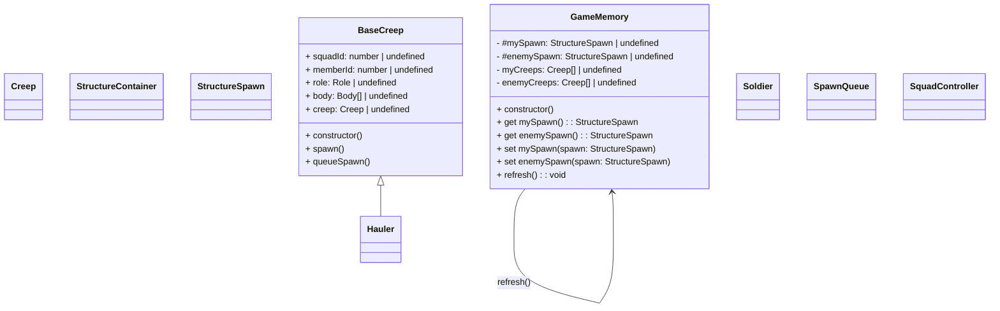

```mermaid
classDiagram
  class Creep {
    %% Game prototype
  }
  class StructureContainer {
    %% Game prototype
  }
  class StructureSpawn{
    %% Game prototype
  }

  class BaseCreep{
    + squadId: number | undefined
    + memberId: number | undefined
    + role: Role | undefined
    + body: Body[] | undefined
    + creep: Creep | undefined
    + constructor()
    + spawn()
    + queueSpawn()
  }
  class GameMemory{
    - #mySpawn: StructureSpawn | undefined
    - #enemySpawn: StructureSpawn | undefined
    - myCreeps: Creep[] | undefined
    - enemyCreeps: Creep[] | undefined
    + constructor()
    + get mySpawn(): StructureSpawn
    + get enemySpawn(): StructureSpawn
    + set mySpawn(spawn: StructureSpawn)
    + set enemySpawn(spawn: StructureSpawn)
    + refresh(): void
  }
  class Hauler{

  }
  class Soldier{

  }
  class SpawnQueue{

  }
  class SquadController{

  }

  GameMemory --> GameMemory : refresh()
  BaseCreep <|-- Hauler
```
